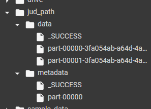

# Praktikum Week 14

## Nama : Jud Amal Mukhtar

## Kelas : TI-3C 

## NIM : 2041720168

1. Slide 30 - Movie Lens Recommendation
	
	Mount Google Drive, menginstal pyspark, dan membuat SparkSession baru.
    
	
	
	Mengimport dataset <code>ratings.dat</code>.
	
	
	
	Kemudian melakukan RDD mapping dan Membuat model rekomendasi menggunakan ALS pada training data yang telah dibuat sebelumnya.
	
	
	
	Hasilnya
	
	
##

2. Slide 48 dan 49
	
	Import dataset <code>ratings.dat</code> lalu parallelize variable myData dan mapping file yg telah diimport. Kemudian train totalRatings menggunakan metode ALS untuk mendapatkan rekomendasi produk.
	
	
	
	hasilnya
	
	
	
	Menampilkan statistik summary mulai dari rata", varian, dll dari vectorRdd rating yang telah di proses sebelumnya
	
	
##

3. Slide 52
	
	Import library KMeans dan Vectors. Kemudian mengimport <code>kmeans_data.txt</code> . Selanjutnya mapping dataset dan konversi menjadi dari RDD menjadi DataFrame dan memasukkan variable parsedData pada method kmeans.fit kemudian Menampilkan summary dari training cost dan prediksi cluster tiap data.
	
	
	
	Hasilnya
	
	
##

4. Slide 53-54
	
	Import library Kmeans, Numpy, dan Math. Kemudian mengimport <code>kmeans_data.txt</code> setelah itu melakukan mapping dengan patokan tiap data dipisahkan menggunakan delimiter spasi . kemudian training data dengan Kmeans. dengan jumlah kluster 2 dan maksimal iterasi 10 dan Menghitung WSSE dari parsedData kemudian melakukan saving model pada folder yang telah disesuaikan
	
	
	
	hasilnya di sidebar
	
	
